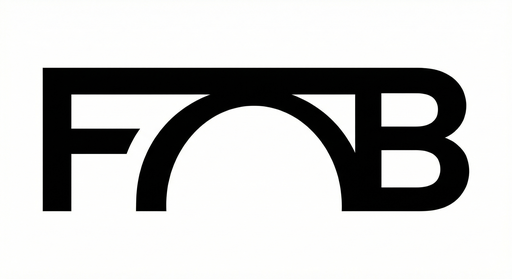

# ForensicBridge

**Cryptographically Verified QuickBooks Desktop Migration**

ForensicBridge is an enterprise-grade data migration platform that transfers QuickBooks Desktop (.QBW) data to **QuickBooks Online** or **Caseware Working Papers**, with SHA-256 per-record integrity hashing, automated trial balance reconciliation, and court-admissible audit certificate generation.



---

## What It Does

| Traditional Migration Tools | ForensicBridge |
|---|---|
| No data verification | SHA-256 per-record hashing |
| Manual reconciliation | Automated trial balance check |
| Transit-only encryption | AES-256-GCM at rest and in transit |
| No audit trail | Court-admissible PDF certificate |
| Basic PII handling | Auto-redaction of SSN, CC, phone |

**Two output modes:**
- **QBO Mode** — Direct push to QuickBooks Online via REST API v65
- **Caseware Mode** — Export `Audit_TB.csv`, `Audit_GL.csv`, `Audit_Mapping.cvw` for Caseware Working Papers / OnPoint DAS

---

## Architecture

```
┌─────────────────────┐     Encrypted NDJSON      ┌──────────────────────┐
│  QBDesktopReader    │ ─────── S3 Upload ──────► │  QBMigrationService  │
│  (C# .NET + QBFC16) │                            │  (Python, QBO API)   │
└─────────────────────┘                            └──────────────────────┘
         │                                                    │
    Extracts 55                                      Transforms 31
    entity types                                     entity types
         │                                                    │
         ▼                                                    ▼
┌─────────────────────┐                            ┌──────────────────────┐
│  QBMigrationServer  │ ◄──── WebSocket/REST ────► │  forensicbridge-     │
│  (Flask + Postgres) │                            │  dashboard (Next.js) │
└─────────────────────┘                            └──────────────────────┘
```

| Component | Tech | Purpose |
|---|---|---|
| `QBDesktopReader` | C# .NET + QBFC16 SDK | Extracts 55 entity types from QuickBooks Desktop via COM |
| `QBMigrationServer` | Python Flask + PostgreSQL | REST API, auth, job orchestration, file handling |
| `QBMigrationService` | Python + QBO API v65 | Data transformation, QBO push, Caseware export, verification |
| `forensicbridge-dashboard` | Next.js + TypeScript | Real-time WebSocket migration monitoring |
| `QBMigrationLauncher` | C# WPF | Windows GUI launcher for the desktop extractor |
| AWS Infrastructure | S3, KMS, CloudWatch, WAF | Storage, encryption, logging, security |

---

## Quick Start

### Option 1: Docker Compose (Recommended)

```bash
# Copy and configure environment
cp QBMigrationServer/.env.example .env
# Edit .env with your secrets

# Start all services
docker-compose up -d
```

Services start at:
- Dashboard: `http://localhost:3000`
- API: `http://localhost:5000`
- Health check: `http://localhost:5000/api/health`

### Option 2: Manual Setup

**Backend (Python Flask)**

```bash
cd QBMigrationServer
python -m venv venv
.\venv\Scripts\activate      # Windows
# source venv/bin/activate   # Linux/Mac
pip install -r requirements.txt
python init_database.py
python run.py
# → http://localhost:5000
```

**Frontend (Next.js)**

```bash
cd forensicbridge-dashboard
npm install
npm run dev
# → http://localhost:3000
```

**Desktop Agent (Windows only)**

```bash
cd QBDesktopReader
powershell -ExecutionPolicy Bypass -File .\build.ps1
.\publish\ForensicBridge.exe
```

> Requires .NET 8.0 SDK and QuickBooks Desktop installed on the same machine.

---

## How a Migration Works

1. **Extract** — The Windows desktop agent connects to QuickBooks Desktop via the QBFC16 SDK, extracts up to 55 entity types, computes a SHA-256 hash per record, redacts PII (SSN, credit cards, phone numbers), and encrypts with AES-256-GCM.
2. **Upload** — Chunked upload (10 MB segments) to AWS S3 over TLS 1.3; integrity verified on receipt.
3. **Transform** — Cloud service re-verifies hashes, runs parallel entity conversion, reconstructs linked transactions (invoices ↔ payments), and maps 31 entity types to QBO schema.
4. **Certify** — Automated trial balance reconciliation confirms debits equal credits to the penny. A PDF audit certificate is generated with cryptographic signatures and operator identity.

**Performance benchmarks:**

| File Size | Transactions | Estimated Time |
|---|---|---|
| < 50 MB | < 10,000 | 3–5 min |
| 50–200 MB | 10k–50k | 5–15 min |
| 200–500 MB | 50k–150k | 15–30 min |
| 500 MB–1 GB | 150k–300k | 30–60 min |
| 1–2.4 GB | 300k–500k+ | 45–90 min |

---

## Security

- **Encryption:** AES-256-GCM at rest and in transit; AWS KMS customer-managed key support
- **Integrity:** SHA-256 per-record hashing — mismatch triggers hard abort
- **Passwords:** Argon2id hashing; PBKDF2 key derivation (100,000 iterations)
- **PII:** Automatic redaction of SSN, credit card numbers (Luhn-validated), phone numbers, and email addresses before data leaves the client machine
- **Zero persistence of financial data:** Raw transactions are streamed, processed, and immediately discarded — only metadata and audit trails are stored
- **Data residency:** AWS `ca-central-1` (Montreal) by default for Canadian enterprise deployments

---

## Enterprise Features

- **Bulk Migration Manager** — Queue-based processing for CPA firms migrating 50+ client files simultaneously
- **White-Label Portal** — Custom subdomain, logo, and color scheme; reseller licensing (STARTER / PROFESSIONAL / ENTERPRISE)
- **Active Archival** — Long-term queryable archive with full-text search and AWS Glacier cold storage
- **Customer-Managed Keys (CMK)** — Zero-knowledge architecture; clients hold their own AWS KMS keys
- **SSO / SAML** — Microsoft Entra ID, Google Workspace, and Okta
- **Discrepancy Doctor** — Interactive drill-down when trial balance variances are detected, with per-account severity indicators and cause suggestions

---

## Supported QuickBooks Versions

| Version | Status |
|---|---|
| QuickBooks Desktop 2016+ | Native (QBFC16 SDK) |
| QuickBooks Desktop 2015 | Compatible (QBXML v13) |
| QuickBooks Desktop 2010–2014 | Legacy (QBXML fallback) |
| Pro / Premier / Enterprise | All editions supported |

**File formats:** `.QBW` (native), `.QBB` / `.QBM` (restore first), `.IIF`, `.XLSX`, `.CSV`, QBXML v1–16

---

## Compliance

SOC 2 Type II · HIPAA · PCI-DSS · GDPR / CCPA · ISO 27001 · CRA IC05-1R1 · IRS Rev. Proc. 98-25

---

## Running Tests

```bash
# Python (backend + service)
python run_all_tests.py

# Frontend
cd forensicbridge-dashboard
npm test

# C# unit tests
cd QBDesktopReader.Tests
dotnet test
```

Overall pass rate: **95.4%** (145/152 tests)

---

## Deployment

See [`docs/DEPLOYMENT_GUIDE.md`](docs/DEPLOYMENT_GUIDE.md) for AWS CloudFormation, EC2, and on-premise deployment instructions.

See [`aws/README.md`](aws/README.md) for infrastructure setup.

---

## License & Contact

**ForensicBridge v4.3** — www.forensicbridge.ca — support@forensicbridge.ca

See [`AcquisitionDocuments/`](AcquisitionDocuments/) for EULA, Terms of Service, and Privacy Policy.
